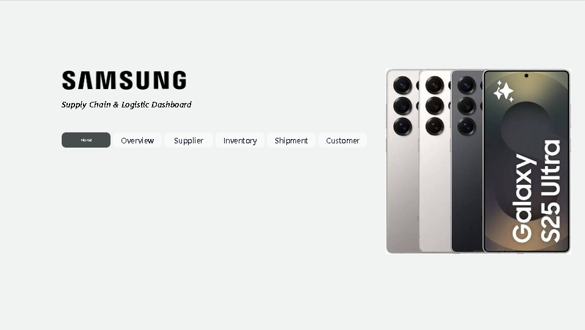
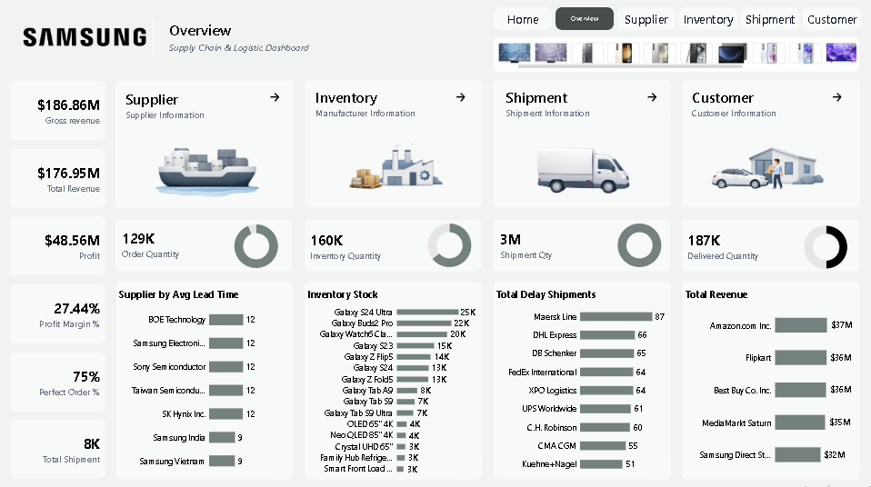
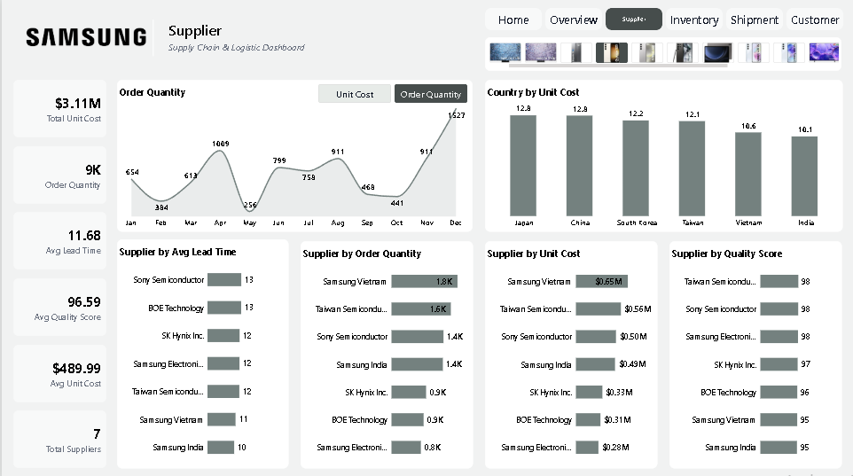
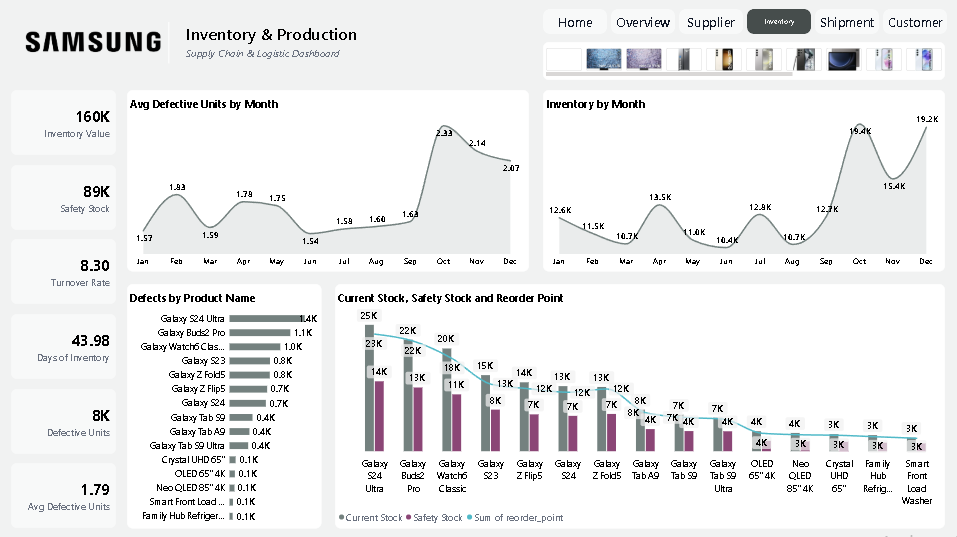
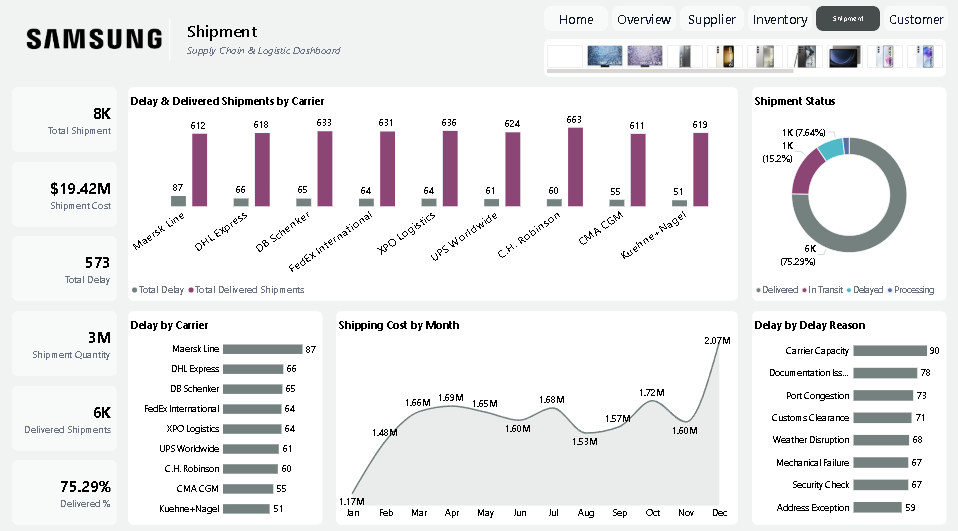
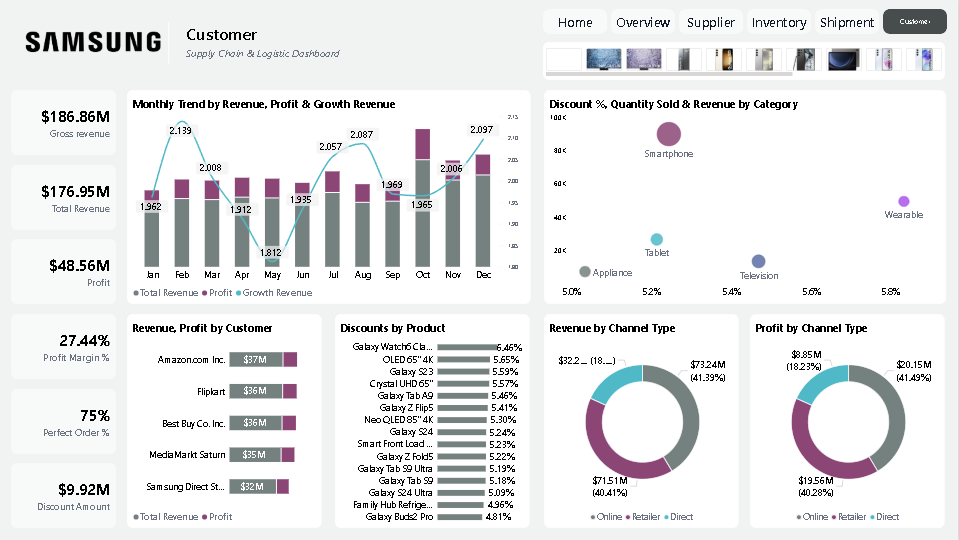
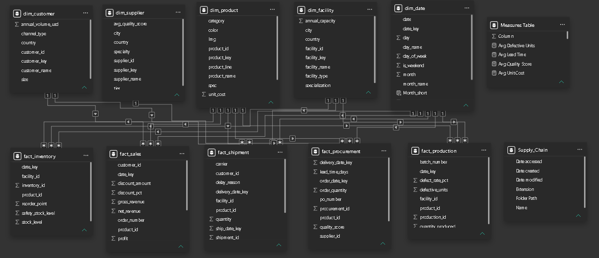
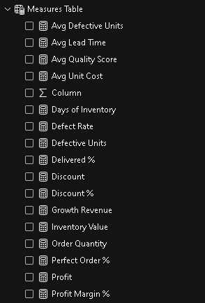
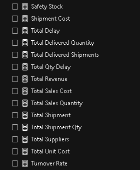
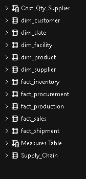

# 📦 Samsung Supply Chain & Logistics Analytics Dashboard

## 📌 Project Overview

This Supply Chain & Logistics Analytics Dashboard was developed using **Power BI** to analyze supplier performance, inventory management, shipment operations, customer insights, and overall supply chain performance.

The dashboard provides end-to-end visibility across the supply chain, helping organizations optimize inventory, reduce delays, improve supplier efficiency, and enhance customer satisfaction through data-driven decision-making.

---

## 🛠 Tools & Technologies

- Power BI
- DAX
- Power Query
- Data Modeling
- Star Schema
- Data Visualization
- Business Intelligence

---

## 📊 Business KPIs

| KPI | Value |
|------|--------|
| Gross Revenue | $186.86M |
| Total Revenue | $176.95M |
| Profit | $48.56M |
| Profit Margin | 27.44% |
| Order Quantity | 129K |
| Inventory Quantity | 160K |
| Shipment Quantity | 3M |
| Delivered Quantity | 187K |
| Perfect Order Rate | 75% |
| Total Shipments | 8K |

---

## 📈 Key Insights

### 🚢 Supplier Analytics

- Supplier Performance Analysis
- Average Lead Time Monitoring
- Supplier Quality Score Analysis
- Unit Cost Comparison
- Supplier Order Quantity Tracking
- Supplier Cost Optimization

### 🏭 Inventory Analytics

- Inventory Stock Monitoring
- Safety Stock Analysis
- Inventory Turnover Analysis
- Reorder Point Tracking
- Defective Product Monitoring
- Days of Inventory Analysis

### 🚚 Shipment Analytics

- Shipment Cost Analysis
- Delivery Performance Tracking
- Shipment Delay Analysis
- Carrier Performance Evaluation
- Delay Reason Analysis
- Shipment Status Monitoring

### 👥 Customer Analytics

- Revenue Analysis
- Profit Analysis
- Customer Performance Evaluation
- Channel-wise Revenue Analysis
- Discount Analysis
- Product Category Performance

---

## ⚙ Technical Features

- Star Schema Data Model
- 40+ DAX Measures
- KPI Development
- Interactive Filtering
- Multi-Page Navigation
- Dynamic Visualizations
- Power Query Data Transformation
- Business Performance Reporting

---

## 📄 Dashboard Pages

### 🏠 Home Page

### 📊 Overview Dashboard

Provides a consolidated view of revenue, profit, inventory, shipment, supplier, and customer performance.

### 🚢 Supplier Dashboard

- Lead Time Analysis
- Supplier Quality Analysis
- Unit Cost Analysis
- Supplier Performance Tracking

### 🏭 Inventory Dashboard

- Inventory Monitoring
- Safety Stock Analysis
- Defective Units Analysis
- Inventory Turnover Metrics

### 🚚 Shipment Dashboard

- Shipment Delay Analysis
- Carrier Performance Evaluation
- Delivery Monitoring
- Shipment Cost Trends

### 👥 Customer Dashboard

- Revenue Analysis
- Profit Analysis
- Channel Performance
- Product Performance
- Discount Analysis

---

## 🏗 Data Modeling

This dashboard follows a **Star Schema Data Model** to improve reporting efficiency and scalability.

### Data Model Preview

---

## 🧮 DAX Measures

Created **40+ DAX Measures** to support advanced KPI calculations and business reporting.

### Examples

- Total Revenue
- Gross Revenue
- Profit
- Profit Margin %
- Perfect Order Rate %
- Average Lead Time
- Shipment Cost
- Inventory Turnover Rate
- Delay Percentage
- Customer Revenue

### DAX Measures Preview

---

## 📋 Tables Used

### Core Tables

- Orders
- Products
- Suppliers
- Inventory
- Shipments
- Customers
- Calendar Table

### Tables Preview

---

## 🎥 Dashboard Walkthrough

A complete dashboard walkthrough video is included in this repository.

**File:** `Supply_Chain_Dashboard.mp4`

---

## 💼 Business Value

This dashboard helps organizations:

✅ Improve supplier performance

✅ Optimize inventory levels

✅ Reduce shipment delays

✅ Monitor logistics costs

✅ Improve delivery efficiency

✅ Increase customer satisfaction

✅ Support strategic business decisions

---

## 📂 Repository Contents

- Supply_Chain_Dashboard.pbix
- Supply_Chain_Dashboard.mp4
- scd1.png
- scd2.png
- scd3.png
- scd4.png
- scd5.png
- scd6.png
- Data_modelling_supplychain.png
- supplychain_measures.png
- supplychain_measures2.png
- Tables_supply_chain.png
- README.md

---

## 🔗 Repository Link

https://github.com/Irfan-Shaik-45/Supply-Chain-Dashboard

---

## 👨‍💻 Author

**Shaik Irfan**

Aspiring Data Analyst

### Connect With Me

🔗 LinkedIn: https://www.linkedin.com/in/shaik-irfan-063b65335

🔗 GitHub: https://github.com/Irfan-Shaik-45

📧 Email: irfanshaik4529@gmail.com

---

⭐ If you found this project useful, please consider giving it a star.
